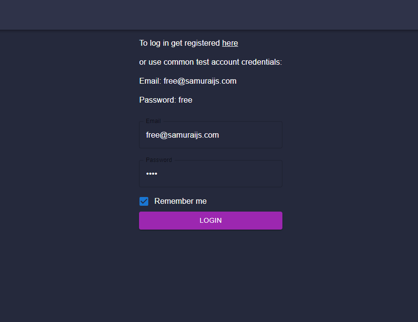
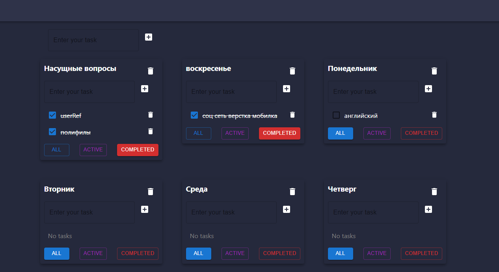

# Happy-Life-Checklist

https://alik-avizha.github.io/Happy-Life-Checklist/

Todolist is a simple and easy-to-use task management app to help you organise your day. It allows you to create a to-do list, helping you to be more organised and efficient.

There are main sections in the app. Here you can create a to-do list

The project is under development.
If you have questions or want to know something, you can write to [me](https://www.linkedin.com/in/aleksandr-avizha/).

---

### Technologies:

- React
- TypeScript
- Redux-Toolkit
- Redux-Thunk
- React-Router-Dom
- Formik
- Axios
- Material UI
- Storybook